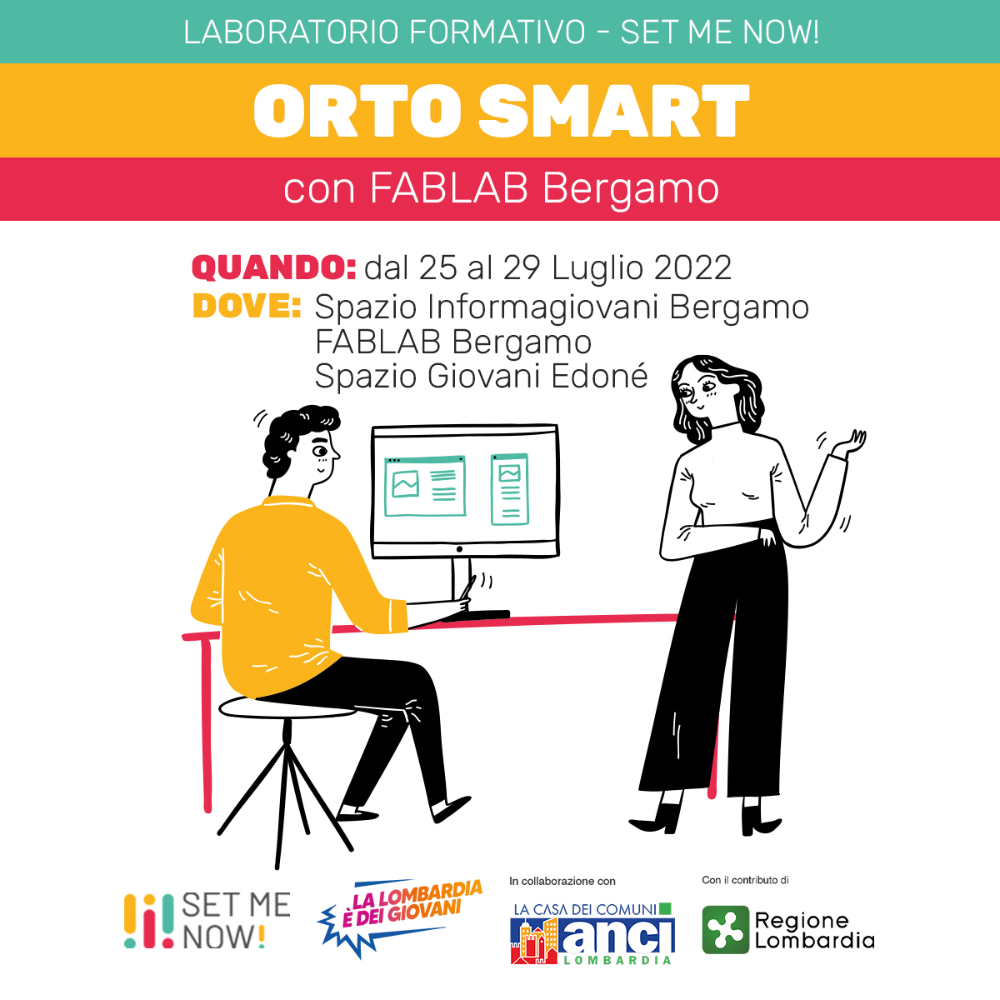

# OrtoSmart
Repository per il workshop di monitoraggio ambientale di Place Me Now

## Setup ESP32
Per questo workshop utilizziamo ESP32 con il framework Arduino. Questi sono gli step da seguire:

### Preparazione dell'ambiente di sviluppo
1. Scarica e installa Arduino IDE. Apri l'IDE al termine dell'installazione
1. Aggiungi il repository di ESP32: `File -> Impostazioni -> URL aggiuntive per il gestore schede` e incolla questa stringa: `https://raw.githubusercontent.com/espressif/arduino-esp32/gh-pages/package_esp32_index.json` 
1. Installa la toolchain di ESP32: `Strumenti -> Scheda -> Gestore schede...`, cerca ESP32 e installa l'ultima versione (2.0.4 al momento della scrittura)
Richiede un po' di tempo e una connessione a internet
1. Installazione delle librerie: sono necessarie diverse librerie. 
1. Seleziona la scheda ESP32: `Strumenti -> Scheda -> ESP32 Arduino -> ESP32 Dev Module`
1. Seleziona la porta COM corretta: `Strumenti -> Scheda -> Porta -> COMxx` (sostituisci xx col numer corretto. Se ce ne sono diverse e non sai quale sia, scollega la scheda e vedi quale scompare)
1. Testa che tutto funzioni correttamente: carichiamo l'esempio Blink. `File -> Esempi -> 01.Basics -> Blink`. Definisci il pin del led aggiungendo `#define LED_BUILTIN 2` prima del setup e carica il codice. La compilazione richiede un po' di tempo. Quando ha finito di compilare, vedrai comparire nel terminale in basso la scritta `Connecting......`, a questo punto premi il pulsante `BOOT` sulla scheda per iniziare il caricamento. Se è andato tutto bene, dovresti vedere il led lampeggiare sulla scheda.
1. Se sei a questo punto, tutto il setup è stato fatto correttamente, e siamo pronti a partire!

### Installazione delle librerie
#### WiFiManager
Questa è una libreria in fase di sviluppo e va quindi installata manualmente. 
1.  Apri la pagina github della libreria [tzapu/WiFiManager](https://github.com/tzapu/WiFiManager/tree/7d498ed50ab92577ecbd0c5ba2b875910356d1ce)
1. Scarica i file: `Code -> Download ZIP`
1. Carica la libreria come ZIP dall'IDE Arduino: `Sketch -> #include libreria -> Aggiungi libreria da file ZIP`

#### InfluxDBClient, DHTStable, BH1750, BMP280_DEV
Tutte le altre librerie che useremo sono in versione stabile e possono essere installate direttamente dal library manager di Arduino.
1. Installa la libreria dal library manager: `Sketch -> #include libreria -> Gestore librerie`
1. Digita nella barra di ricerca `InfluxDB` e installa la libreria `ESP8266 Influxdb` di Tobias Schuerg v3.12.0
1. Digita nella barra di ricerca `DHTStable` e installa la libreria `DHTStable` di Rob Tillaart v1.1.1
1. Digita nella barra di ricerca `BH1750` e installa la libreria `BH1750` di Christopher Laws v1.3.0
1. Digita nella barra di ricerca `BMP280_DEV` e installa la libreria `BMP280_DEV` di Martin Lindupp v1.0.21

## Caricamento Firmware
Quando faremo riferimento al caricamento del firmware, se dovessi avere dubbi segui questa procedura: 
1. Seleziona la scheda ESP32: `Strumenti -> Scheda -> ESP32 Arduino -> ESP32 Dev Module`
1. Seleziona la porta COM corretta: `Strumenti -> Scheda -> Porta -> COMxx` (sostituisci xx col numer corretto. Se ce ne sono diverse e non sai quale sia, scollega la scheda e vedi quale scompare)

